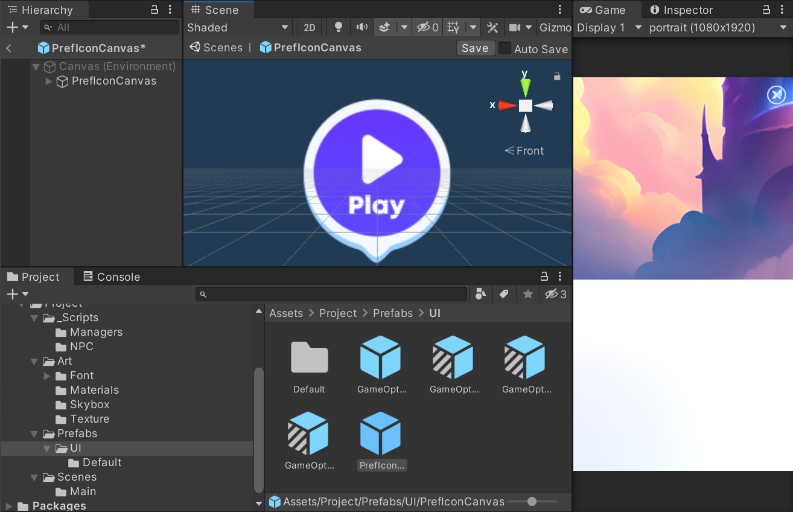

# Rock-Paper-Scissors game

## 📢 About

Nice to meet you Creators! 👋 Welcome to Rock-Paper-Scissors template guide!  

With Rock-Paper-Scissors you can create amazing worlds to play with your friends!  

Now, are you ready to start?  

## Overview
In the game, players make selections by choosing between rock, paper, or scissors.
Rock, Paper, Scissors is a simple sleight of hand game played in pairs, where each player simultaneously chooses one of three shapes. The possible outcomes are: the rock crushes the scissors, the scissors cut the paper, and the paper covers the rock.
  
  

## ❓ How to create with Rock-Paper-Scissors template

:wrench: Installation and settings

- If you haven't install the Zepeto World you can check how to do it  <a href="https://docs.zepeto.me/studio/reference/installation_and_settings">Here!</a>

- Once you have installed Zepeto, you have to pull this repository and you can do it in 3 ways
  - [Cloning it](#cloning-the-project)
  - [Downloading it](#downloading-the-project)
  - [By Unitypackage](#getting-it-from-the-releases-section)

### Cloning the project

First we go to the [Code] button and click it.

 </img> 

Then click on the icon to copy the link of the repository (make sure that you are on the https tab) or copy it manually.

 </img> 

Once you have it, using your your preferred software.
In this case we are using <a href="https://git-fork.com/" target="_blank"> Fork</a> click on "File->Clone" or press "Ctrl + N" to clone.

 </img> 

Here we fill the URL tab and set the folder where you want to save it and press clone.

 </img> 

Once it clones the project you can open it from Unity Hub.  

### Downloading the project

Click on the same [Code] button but instead of clicking on the link, click on download zip

 </img> 

Then extract the files and open it with Unity.  

### Getting it from the releases section

Go to the releases section or click in the latest release.

 </img> 

Then click on the file ".unitypackage" and import it in a new project of Unity!

 </img> 

> 💡 Enjoy and start creating with the Template! :tada:
 

## ❓ FAQ

How to open the project 

Select the template folder and it will open the project.
 </img>

To open a Unity project for the first time, follow these steps:

1. Launch Unity Hub.
2. In Unity Hub, click on the "Projects" tab on the left side.
3. Click on Add: If your project is not already listed, click on the "Add" button to add your project to the list. Navigate to the folder where your Unity project is located and select the folder. Click "Open" to add the project to Unity Hub.
4. Select Project: Once your project is added to the list, click on it to select it.
5. Wait for Unity to Load: Unity will now open your project. This may take some time depending on the size of your project and your computer's performance.
6. Project Opened: Once Unity has finished loading, your project will be opened and ready for you to work on.

How to play 
 
Before you press play to test the template you have to open the scene.  

 To play the game template in Unity, follow these steps: 

1. Open the Scene: First find the scene in the next folder and open it.
 </img>  
2. Play the Template: then you can press [Play] to test the template.

  

## 🔨 Tools
  

Game prefab
  
To make things easier, there is a prefab called "RPS_Game" that you can drag into your game scene, and the mini-game will be already functional. You just need to place it wherever you want.

 </img> 
  

UIManager
 
In the UIManager you have some options to tweak how the game looks like.

| Variable         | Utility                                                                       |
| ---------------- | ----------------------------------------------------------------------------- |
| Rock Sprite      | Set the Rock sprite in game                                                   |
| Paper Sprite     | Set the Paper sprite in game                                                  |
| Scissors Sprite  | Set the Scissors sprite in game                                               |

 </img> 
 

NPCCreator

The NPCCreator has its own documentation in ZEPETO docs, here is the link to check it out!  
<a href="https://docs.zepeto.me/studio-world/docs/creating-and-controlling-npc" target="_blank"> Zepeto Pages </a>.
  

IconInteraction

The IconInteraction like the NPCCreator have his own docs here:  
<a href="https://docs.zepeto.me/studio-world/docs/interacting-with-an-object#step-2--setting-the-object" target="_blank"> Zepeto Pages </a>)
If you want to change the icon that appears over the NPC you have to change the PrefIconCanvas prefab
 </img>
 

## :point_right: You can easily modify this:

<h3>RPS_Game Prefab:</h3>

**The idea behind this template is to provide you with a game ready to add to your world**

1. Open your Unity project and navigate to the location of the "RPS_Game" prefab.
2. Drag the "RPS_Game" prefab from the project window into your game scene hierarchy.
3. Place the "RPS_Game" prefab wherever you want it to appear in your game scene.
4. The mini-game will be fully functional, and you can test it within your game scene.

However, you can customize it in the following ways:

- <h3> IconInteraction</h3>
If you want to change the icon that appears over the NPC you have to change the PrefIconCanvas prefab:
1. Locate the PrefIconCanvas prefab in your Unity project.
2. Right-click on the PrefIconCanvas prefab and select "Edit Prefab" to open it in the Prefab Editor.
3. In the Prefab Editor, find the icon element that you want to change.
4. Select the icon element and replace it with your desired icon. You can do this by dragging and dropping a new sprite onto the icon element.
5. Once you have replaced the icon, click on "Apply" in the Prefab Editor to save your changes to the Prefab.
6. Close the Prefab Editor and return to your scene.
7. The icon that appears over the NPC should now be updated with your new icon.

- <h3>UI Prefabs</h3>
You can edit every panel of each part of the game from their own prefab.
You can found them in the project folder.

  To modify UI prefabs in Unity, follow these steps:
1. Locate the UI prefab you want to modify. You can find prefabs in the project folder under the "Prefabs" directory or in a specific folder for UI elements.
2. Double-click on the UI prefab to open it in the Prefab Editor.
3. In the Prefab Editor, you can modify the UI elements as needed. This may include changing text, images, layouts, or adding/removing components.
4. Once you have made your modifications, save the prefab by clicking the "Apply" button in the Prefab Editor.
5. To apply the changes to instances of the prefab in your scene, select each instance and click the "Apply" button in the Inspector window.
6. Test your changes in Play mode to ensure they work as expected.
7. If you need to make further modifications, repeat the above steps.

